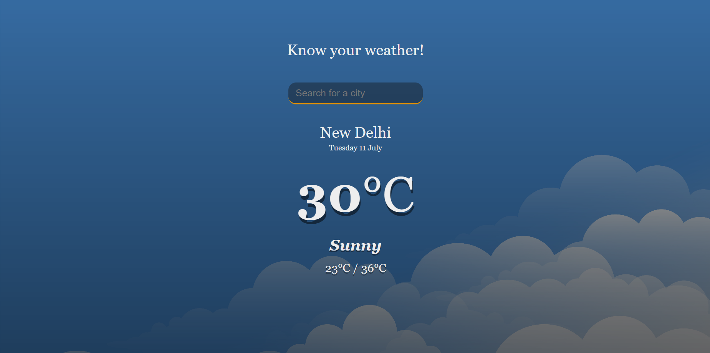

# Weather App

This is a basic weather app created using HTML, CSS and JavaScript.

## Table of Contents
- [Overview](#Overview)
  - [Screenshot](#screenshot)
  - [Links](#links)
- [Author](#author)

## Overview

### Screenshot

### Links
- Solution URL: [Github](https://github.com/Dante-afk/Weather-app)
- Live Site URL: [Live solution](https://weather-app-dante-afk.vercel.app/)

## Author

- Website - [Dhruv Mehta](https://dhruvmehta02.netlify.app/)
